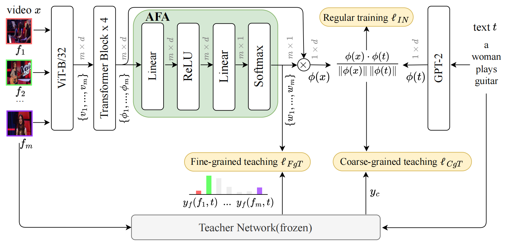

# Reproduce TeachCLIP

The official source code of our CVPR24 paper TeachCLIP, "[Holistic Features are almost Sufficient for Text-to-Video Retrieval](https://openaccess.thecvf.com/content/CVPR2024/papers/Tian_Holistic_Features_are_almost_Sufficient_for_Text-to-Video_Retrieval_CVPR_2024_paper.pdf)".



## Environment

We used Anaconda to setup a deep learning workspace that supports PyTorch. Run the following script to install all the required packages.

```shell
conda create -n TeachCLIP python==3.9 -y
conda activate TeachCLIP
git clone https://github.com/nhattan2005/reproduce_TeachCLIP.git
cd TeachCLIP
pip install -r requirements.txt
```


## Data

### Data download

+ The paper provides annotations for five datasets and checkpoints for three teacher models (X-CLIP, TS2-Net, and XPool) trained on these datasets [Google drive](https://drive.google.com/drive/folders/1cU0ehXfucf4M5IyDRSxywBadCt1LyZWz?usp=sharing). The video captions and data splits are available in the Annotations and VideoSet folders.

+ To download raw videos, use the following command (for MSRVTT as an example):
```shell
wget https://www.robots.ox.ac.uk/~maxbain/frozen-in-time/data/MSRVTT.zip
unzip MSRVTT.zip
```

+ Place the videos into the corresponding VideoData folder for each dataset. Using symbolic links is recommended for better data management.

### Data organization

Before starting to run the code, please organize the downloaded data in the following format: (The `Models` and `FeatureData` folders will be automatically generated during training and testing, respectively.)

```shell
data
├── datasets
│   ├── msrvtt
│   │   ├── Annotations
│   │   │   ├── MSRVTT_data.json
│   │   │   ├── MSRVTT_JSFUSION_test.csv
│   │   │   └── ...
│   │   ├── FeatureData
│   │   ├── Models
│   │   │   └── msrvtt-7k_xclip+ts2net-as-teacher_vit32
│   │   │       ├── run0
│   │   │       └── ...
│   │   ├── QuerySet
│   │   │   ├── msrvtt1k-test-query.txt
│   │   │   ├── msrvtt3k-test-query.txt
│   │   │   └── ...
│   │   └── VideoData
│   │   │   ├── video0.mp4
│   │   │   ├── video1.mp4
│   │   │   └── ...
│   │   └── VideoSet
│   │       ├── msrvtt1k-test.txt
│   │       ├── msrvtt1k-train.txt
│   │       └── ...
│   ├── activitynet
│   ├── didemo
│   ├── msvd
│   └── vatex
└── teacher_checkpoints
    ├── xclip
    │   ├── didemo_xclip_model.bin
    │   ├── msrvtt-7k_xclip_model.bin
    │   └── ...
    ├── ts2net
    └── xpool
```

## Code

### Inference

Use the following command to extract video / text features:

```shell
bash do_extract_video_feat.sh $test_collection $videoset $model_name
# Example
CUDA_VISIBLE_DEVICES=0 bash do_extract_video_feat.sh msrvtt msrvtt1k-test xclip

bash do_extract_text_feat.sh $test_collection $queryset $model_name
# Example
CUDA_VISIBLE_DEVICES=0 bash do_extract_text_feat.sh msrvtt msrvtt1k-test-query xclip
```

### Evaluation

After extracting the features, evaluate the model's performance using the following command:

```shell
bash do_eval.sh $test_collection $text_feat_name $video_feat_name $gt_file_name
# Example
CUDA_VISIBLE_DEVICES=0 bash do_eval.sh msrvtt msrvtt1k-test-query msrvtt1k-test msrvtt1k-gt
```

The evaluation results will display metrics such as R@1, R@5, R@10, Median Rank, and Mean Rank for both text-to-video and video-to-text retrieval.
